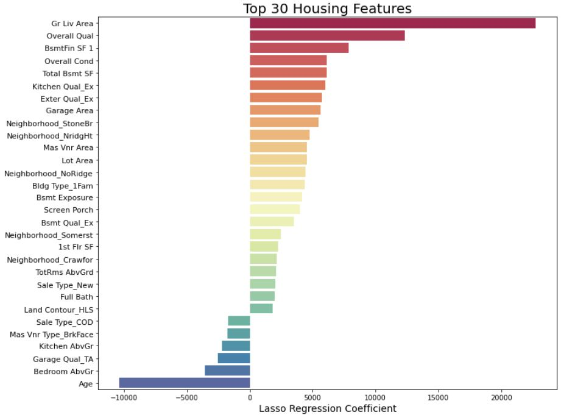

## Problem Statement

I imagine myself to be working for fund managing a portfolio of properties within Ames Iowa and am given a challenge:
To build a regression model which predicts property prices in Ames Iowa which is accurate and explainable to non data science folks.

The business intends to use the model in addition to existing real estate valuation models, and their long experience in the real estate field, to identify the timing to purchase and sell properties, and redevelop and renovate properties to unlock the value of their properties. This is all for the purpose of giving them an unfair advantage over their competitors, so that they can outperform the other funds in this industry. 

## Executive Summary
We often hear this about properties : Location location, location. Is there all it is in property?

Using a housing dataset from Ames, Iowa, I have successfully created a linear regression model that predicts housing sale prices, using regularisation, and feature engineering methods. My model uses 119 features in total and gives a RMSE of 20k. It also performed well on Kaggle, giving private score of 19k, and public score of 25k. 

## Key Findings

- 1) Top features are Gr Liv Area and Overall Qual, showing that location is not everything.

- 2) Location seems to only matter heavily when its in the prime estates like Northridge Heights.

- 3) Interestingly, some feature such as kitchen quality, exterior quality that property managers may see as low hanging fruits to create value for their properties.

## Conclusions
My findings are limited to Ames Iowa. It should be generalisable, but will probably not be relevant for other cities.

The fund could potentially look at the following:

1) Have a keen focus on properties located in NrigeHt, StoneBr, NoRidge, Somerset and Crawford, BrkFace.

2) They have the choice to renovate features to Excellent condition that home buyers may be willing to pay more for, such as quality of Kitchen, basement and overall condition.

3) Improving quality of features to excellent can also significantly improve the price of the property.

4) They can refer to the list and prioritize those features, as those are supoosed to have the most impact on sales price.

Ultimately, cost benefit analysis should be done by the fund, to see if the benefit of renovating outweighs the cost of renovation.

The full data dictionary can be found [here](http://jse.amstat.org/v19n3/decock/DataDocumentation.txt)

