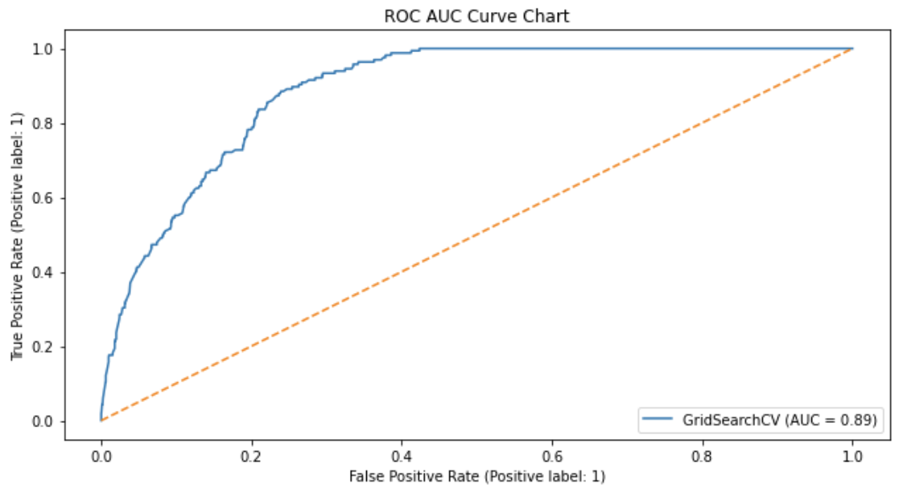
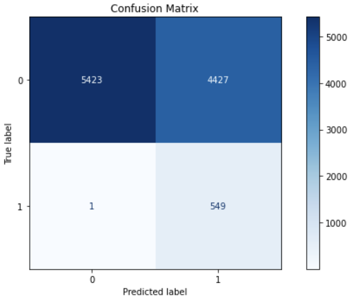

## Problem Statement

West Nile virus (WNV) is the leading cause of mosquito-borne disease in the continental United States. There are currently no vaccines to prevent or medications to treat WNV in people. Fortunately, most people infected with WNV do not feel sick. 

As data scientists working at Disease And Treatment Agency, division of Societal Cures In Epidemiology and New Creative Engineering (DATA-SCIENCE), due to the recent epidemic of WNV in the Windy City, we've had the Department of Public Health set up a surveillance and control system. Our task is to predict occurences of the WNV using the dataset provided by the Chicago Department of Public Health (CDPH), and to evaluate the cost and benefit of spraying.

Around 20% of people who become infected with WNV develop symptoms ranging from a persistent fever, to serious neurological illnesses that can result in death. Around 1 to 5% of infected people end up dying. As this is not a small number, the problem warrants attention from the authorities. 

As this is a team project, our project plan documentation can be found here. [*link*](https://docs.google.com/spreadsheets/d/1-ZFMbKlwWW09KibHc6Yx5GV0KR207BQ6kk5W6ksB2k4/edit#gid=1732373189)

## Executive Summary
A data science approach was used to guide the process. The problem statement was defined as building a predictive model which has high Receiver Operating Characteristics area under curve (ROC AUC), and high sensitivity in predictions of occurence of West Nile Virus based on features that are fed to the model.

Data was extracted from Kaggle. Data was imported as a dataframe and cleaned before merging. An exploratory data analysis was to evaluate and understand key trends, and weather, train and spray dataframes were explored in how it will be visualized. 

Inferences are made at each visualisation and exploratory data analysis stage, and external reasons were made to give insights. 

During modelling phase, several models were tested, including Logistic Regression, Random Forest, SVM and XGBoost. In order to deal with imbalanced class problem, Synthetic Minority Oversampling Technique (SMOTE) was used. XGBoost was chosen for further tuning as it had the highest ROC AUC score, and the best accuracy scores. However, sensitivity was not the highest.

Below is an summary of tested models.

|Model|---|HyperParameters|Sensitivity|Accuracy|Specificity|Precision|F1 Score|Train Score|Test Score|AUC|Remarks|
|---|---|---|---|---|---|---|---|---|---|---|---|
|Base Model|Logistic Regression|---|0.0|0.947|1.0|NAN|0.0|0.947|0.947|0.79|
|Model Selection|---|---|---|---|---|---|---|---|---|---|---|
|Model 1|Logistic Regression,SMOTE|SMOTE_random_state=100, Logreg_random_state=100, Logreg_solver='liblinear', Logreg__C=1, Logreg_penalty=11, PCA__n_components=23, SMOTE__k_neighbors=13, SMOTE__sampling_strategy: auto|0.655|0.758|0.768|0.134|0.225|0.760|0.758|0.78|---|
|Model 2|Random Forest,SMOTE|SMOTE_random_state=100, rf__max_depth=None, rf__n_estimators=200, sampling__k_neighbors=13,sampling__sampling_strategy=minority|0.158|0.929|0.972|0.241|0.190|0.929|0.929|0.78|---|
|Model 3|SVM, SMOTE|SMOTE_random_state=100, sampling__k_neighbors=13,sampling__sampling_strategy=auto|0.503|0.850|0.870|0.177|0.261|0.847|0.850|0.78|---|
|Model 4|Xgboost, SMOTE|SMOTE_random_state=100, sampling__k_neighbors=13,sampling__sampling_strategy=auto,xgb__learning_rate=0.5, xgb__max_depth=None, xgb__n_estimators=50|0.176|0.936|0.978|0.311|0.224|0.933|0.936|0.84|Best Model| 
|Hyperparameter Tuning|---|---|---|---|---|---|---|---|---|---|---|
|Tuning Model 1|Xgboost|xgb__gamma=1, xgb__learning_rate=0.1, xgb__max_depth=5, xgb__min_child_weight=25, xgb__n_estimators=60, xgb__scale_pos_weight=19, xgb__subsample=1|0.745| 0.749|0.749|0.142|0.239|0.730|0.749|0.83|---|
|Tuning Model 2|Xgboost|xgb__gamma=1, xgb__learning_rate=0.1, xgb__max_depth=5, xgb__min_child_weight=25, xgb__n_estimators=60, xgb__scale_pos_weight=63, xgb__subsample=1|0.878| 0.601|0.585|0.105|0.189|0.591|0.601|0.83|Used for Production Model|
|Production Model|---|---|---|---|---|---|---|---|---|---|---|
|Production Model|Xgboost|xgb__gamma=1, xgb__learning_rate=0.1, xgb__max_depth=5, xgb__min_child_weight=25, xgb__n_estimators=60, xgb__scale_pos_weight=63, xgb__subsample=1|0.998|0.574|0.551|0.110|0.198|0.427|---|0.89|---|

In our exploration, we found out that using scale_pos_weight, another means of dealing with imbalanced class problems, can be used to further overweight the minority class. Paired with GridSearch, we were able to optimise the sensitivity to 0.998 for our production model, with a scale_pos_weight of 63.

Sensitivity is important as we want to lower false negatives. False negatives lead to unpredicted WNV cases, where preemptive vector control efforts cannot be implemented. This can have consequences such as severe illness or even death. 

Below is a summary of our production model confusion matrix and ROC AUC curve.

## Cost benefit analysis
We sought to answer if it was cost effective to spray, through the use of a cost benefit analysis. 

For benefits modelling, we took reference to Barber et al (2010) [*source*](https://www.ncbi.nlm.nih.gov/pmc/articles/PMC3322011/#R10) and Staples et al (2014) [*source*](https://www.ncbi.nlm.nih.gov/pmc/articles/PMC3945683/#R15) to estimate medical and economical cost of West Nile fever (WNF), West Nile neuroinvasive disease (WNND) and death. Chicago 2002 West Nile epidemic was used to approximate the worst case scenario, where 22 death and 225 cases of WNV were recorded.

For cost modelling, we took the total estimated area of Chicago, multiplied by the cost of spray per acre of Zenivex, the adulticide of choice of Chicago. This is then multiplied by the number of sprays that are announced in the past. The resultant cost is an overestimation of spraying efforts, as based on 2011 and 2013 spray data, we did not see the entire city being indiscriminately sprayed. However, for cost benefit analysis purpose, such conservative estimation would allow us to factor in worst case scenarios where the entire city do indeed require spraying.

Our results from cost benefit analysis gave us a clear 5.5million net benefit, suggesting that it is a good economic decision to spray.

## Recommendations
We conclude that spraying is a pillar of strong vector control. It can be used in an emergency. However it is not a silver bullet, and it is costly. Instead a multi pronged approach is proposed. 

Firstly, get citizens involved. The CDPH can do so by educating the citizens to avoid outdoors during time between dawn and dusk, apply insect repellent when outdoors and wear covered clothing, close windows and doors when indoors, and cooperate by removing stale water.

Secondly, use of larvicides have synergistic effects with spraying, since adulticides don’t kill mosquito larvae

Thirdly, spraying of hotspots like O Hare Airport and South Doty Avenue, and continued surveillance and testing of WNV would be beneficial as well.

## Future works
For areas of future work, we would want to look at leading weather indicators that can tell us where we should spray 2 weeks from today’s date. This would allow preemptive preparation and action so that we don’t get caught by surprise.

